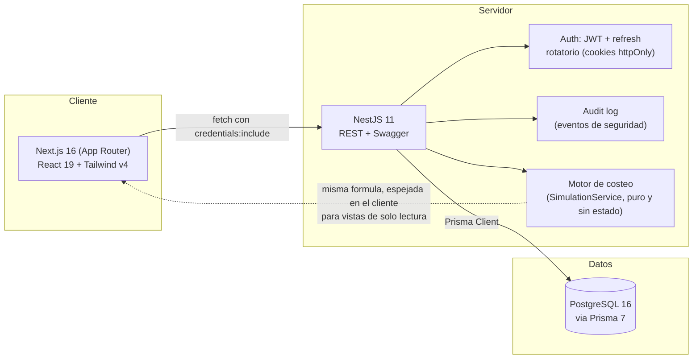

<p align="center">
  <b>Prodexa</b><br>
  <i>Plataforma de costeo y rentabilidad para formulaciones de alimentos y cosméticos</i>
</p>

<p align="center">
  
  
  
  
  
  
  
</p>

<p align="center">

| Statements                  | Branches                | Functions                 | Lines             |
| ---------------------------- | ----------------------- | ------------------------- | ------------------ |
|  |  |  |  |

</p>

---

## Que problema resuelve

Quien produce alimentos o cosméticos en pequeña escala normalmente calcula costos, márgenes y precios de venta en una hoja de cálculo que se vuelve inconsistente apenas hay más de un par de productos: precios de insumos desactualizados, márgenes que nadie recuerda por qué se fijaron así, y cero trazabilidad de qué cambió y cuándo.

Prodexa reemplaza esa hoja de cálculo con una plataforma real: cada formulación tiene su historial completo de cambios, su cumplimiento regulatorio (registro sanitario y vencimientos), su rentabilidad calculada con el mismo motor de costeo en todas partes, y un panel de análisis que responde la pregunta que más importa — **cuánto deja cada producto, y cómo se compara con los demás**.

## Demo


*(Registro → creación de formulación → análisis de rendimiento → calidad → reportes, grabado en local con Playwright.)*

## Recorrido por la aplicación

| Sección | Qué hace |
|---|---|
| **Dashboard** | KPIs de margen y utilidad con filtro por periodo, formulación y categoría; gráfico de márgenes. |
| **Formulaciones** | CRUD completo con ingredientes, preparación enriquecida, categoría, registro sanitario, historial de versiones (snapshot completo en cada edición) e historial de precios por ingrediente. Buscador y duplicado de formulaciones. |
| **Producción** | Escala cualquier formulación a la cantidad objetivo y calcula el costo real del lote; cada lote producido queda registrado como una orden de producción persistente. |
| **Costos** | Simulador de precio de venta con descuentos/mayoristas y desglose de costo por ingrediente. |
| **Análisis** | Ficha de rendimiento por formulación: costo, precio de venta, utilidad, punto de equilibrio, utilidad real acumulada (a partir de las órdenes de producción), desglose de costo por ingrediente y ranking frente a las demás formulaciones. Exportable a PDF. |
| **Calidad** | Estado del registro sanitario de cada formulación (vigente / por vencer / vencido), con fecha y estado editables directamente en la tabla — incluye un override manual para casos como "en trámite de renovación" que la fecha sola no puede representar. |
| **Reportes** | Reporte consolidado de rentabilidad exportable a PDF (con mini-gráfico de márgenes) y CSV, con filtro por rango de fechas. |
| **Configuración** | Perfil, margen por defecto para formulaciones nuevas, cambio de contraseña y gestión de sesiones activas (ver/revocar). |

## Arquitectura



La API vive detrás de `/api/v1`; `/health` y `/ready` quedan fuera de ese prefijo a propósito porque un orquestador los golpea sin versionar.

## Decisiones de ingeniería que no son obvias

- **RBAC deliberadamente descartado, no omitido.** Se evaluó agregar roles admin/usuario y se decidió no implementarlo: hoy cada cuenta es independiente y ve solo sus propios datos, sin necesidad real de compartir formulaciones entre usuarios distintos. Agregar roles sin un caso de uso real habría sido complejidad especulativa. La decisión y su fecha quedan documentadas en el checklist de ejecución, no perdidas en un commit.
- **El motor de costeo es una función pura, reusada en cuatro lugares distintos.** `SimulationService.calculate()` (backend) y su espejo en `lib/costing.ts` (frontend) son la única fuente de verdad para costo/precio/utilidad — los usan el simulador de Costos, el Dashboard, Análisis y las órdenes de producción. Ningún lugar recalcula la fórmula a su manera; un cambio en la lógica de negocio se hace en un solo sitio y se prueba en aislamiento (`simulation.service.spec.ts`).
- **El historial de versiones guarda el snapshot completo, no solo el precio.** `FormulationVersion` captura ingredientes, margen, preparación y registro sanitario en cada edición — distinto y más completo que el historial de precios por ingrediente (`SupplierPrice`), que existe aparte porque responde una pregunta distinta (cuánto costaba este insumo en el tiempo).
- **La auditoría de seguridad es un log separado de los datos de negocio.** `AuditLog` registra login/logout/registro/cambio de contraseña con IP y user-agent, y su escritura **nunca** puede tumbar el flujo principal si falla (se atrapa y se loguea, nunca se relanza) — una decisión explícita verificada con test.
- **Accesibilidad validada con herramienta automatizada, no a ojo.** Cada pantalla nueva se corrió contra `@axe-core/playwright` (WCAG 2.1 AA) en modo claro y oscuro; las violaciones de contraste que encontró (y que una revisión visual no habría atrapado) están corregidas y verificadas en 0.
- **Logging estructurado con correlation id, listo para producción.** Cada request lleva un `X-Request-Id` (se reutiliza si el cliente ya lo manda) que aparece tanto en los logs JSON como en la respuesta de error — así un reporte de bug se puede rastrear exactamente en los logs sin adivinar.

## Stack técnico

| Capa | Tecnología |
|---|---|
| Frontend | Next.js 16 (App Router), React 19, TypeScript, Tailwind CSS v4, Framer Motion |
| Backend | NestJS 11, Prisma 7 (driver adapter `@prisma/adapter-pg`), class-validator |
| Datos | PostgreSQL 16 |
| Auth | JWT (access 15 min) + refresh token opaco rotatorio, Argon2, cookies httpOnly |
| Observabilidad | pino-http (logs JSON estructurados + correlation id), `/health` y `/ready` |
| Calidad | Jest (backend), Playwright + axe-core (E2E y accesibilidad, frontend) |
| CI | GitHub Actions: tests + typecheck + lint + quality gate de cobertura (`test.yml`), gitleaks, `npm audit`, Dependabot (`security.yml`) |

> Redis está provisionado en `docker-compose.yml` para cuando se necesite cache o un store de rate-limiting distribuido, pero hoy no está conectado a ningún código — se documenta así en vez de aparentar que ya se usa.

## Empezar en local

Requisitos: Node 20+, Docker.

```bash
npm install
npm run db:up             # Postgres en localhost:55432
npm run prisma:generate
npm run prisma:migrate
npm run dev                # backend :3000, frontend :3001
```

Documentación interactiva de la API: `http://localhost:3000/api/docs` (Swagger). Se expondrá públicamente cuando el proyecto se despliegue.

## Testing y cobertura

Pirámide de testing completa, cada nivel corriendo contra algo real (nunca solo mocks):

```bash
npm run test:backend           # backend: 96 unit tests, Jest, contra Prisma mockeado
npm run test:backend:e2e       # backend: 16 tests de integracion contra Postgres real (prodexa_test)
npm run test:frontend          # frontend: 16 unit tests, Vitest, sobre lib/costing, lib/format, lib/export
npm run test:frontend:e2e      # frontend: 4 flujos E2E con Playwright (auth, CRUD, simulacion, dashboard) + axe-core
npm run test:coverage          # backend con reporte de cobertura (falla si baja de los umbrales, ver abajo)
```

Los badges de cobertura arriba se actualizan con `npm run badges:update` (lee `apps/backend/coverage/coverage-summary.json` real, generado por Jest — no son un numero fijo a mano). Las exclusiones de cobertura (`*.module.ts`, `*.dto.ts`, `main.ts`) son deliberadas: son wiring/decoradores sin lógica ejecutable propia, no código sin probar escondido.

**Integration testing contra base de datos real, no mocks.** `apps/backend/test/*.e2e-spec.ts` levanta la app de Nest completa (el mismo pipeline de `main.ts`: prefijo, cookies, `ValidationPipe`, filtro de errores) contra `prodexa_test`, una base Postgres dedicada. Cubre registro/login/refresh/logout, y — el caso que de verdad importa en una app multi-cuenta — que un usuario **no puede ver, editar ni eliminar** una formulación ajena (404, no 403: la API no revela ni que existe).

**Quality gate real, no solo aspiracional:** `coverageThreshold` en `apps/backend/package.json` exige >=95% de statements/lines/functions y >=80% de branches — `npm run test:cov` falla (exit code distinto de cero) si la cobertura baja de ahí. `.github/workflows/test.yml` corre unit tests + integration/e2e contra un Postgres de servicio + unit tests de frontend en cada push/PR a `main`, además de typecheck y lint en ambas apps. Falta un paso manual de configuración en GitHub (branch protection → "Require status checks to pass") para que ese check bloquee el merge de verdad y no solo aparezca en rojo.

## Roadmap

- [x] Fase 0-5: gestión, arquitectura, dominio de costeo, autenticación y seguridad, UX/dashboard profesional.
- [x] Observabilidad basica: `/health`, `/ready`, logging estructurado con correlation id.
- [ ] Cobertura de integración contra Postgres real y E2E de los flujos de simulación/dashboard completos.
- [ ] Despliegue (Vercel + Railway/Neon) y Swagger público.

## Autor

**Tomás Posada** — [tomasposada67@gmail.com](mailto:tomasposada67@gmail.com)
