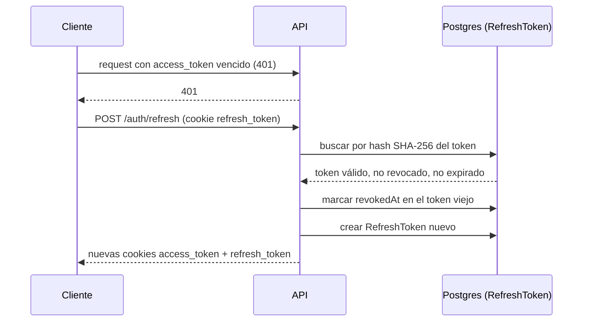

# Autenticación

## Sesión por cookies, no por header

`POST /auth/login` no devuelve un token en el body para guardar en `localStorage` —
emite dos cookies `httpOnly` (no accesibles desde JS del navegador):

- `access_token`: JWT, vive 15 minutos (`JWT_ACCESS_TTL`).
- `refresh_token`: opaco (no es un JWT), vive 30 días por defecto
  (`JWT_REFRESH_TTL_DAYS`).

El frontend nunca lee ni maneja estos valores directamente — cada `fetch` va con
`credentials: 'include'` y el navegador adjunta las cookies solo.

## Contraseñas

Argon2 (`argon2.hash`/`argon2.verify`), nunca MD5/SHA ni texto plano. Requisitos en
registro: mínimo 8 caracteres, mayúscula, minúscula, número y carácter especial.

## Rotación del refresh token

El refresh token nunca se guarda en texto plano: `RefreshToken.tokenHash` es el
SHA-256 del valor real. Un dump de la base de datos no expone tokens usables
directamente. Cada uso invalida el token anterior (`revokedAt`) — si alguien roba un
refresh token y lo usa, el uso legítimo siguiente del dueño real detecta que su token
ya no es válido.

## Sesiones activas

`GET /auth/sessions` lista los `RefreshToken` no revocados y no expirados del usuario,
marcando con `actual: true` el que corresponde a la cookie de la request (comparado
por hash, nunca se compara ni se expone el valor crudo). `DELETE /auth/sessions/:id`
revoca una sesión específica — así un usuario puede cerrar sesión en un dispositivo
que ya no reconoce sin tener que cambiar su contraseña.

## Roles

Ver la tabla completa en [`docs/api/endpoints.md`](endpoints.md) y el contexto de la
decisión en [ADR-005](../adr/ADR-005-rbac-organizaciones-multiusuario.md). Resumen:
`ADMIN`/`COORDINADOR` pueden mutar (formulaciones, proveedores, equipo, tarifas);
`MIEMBRO` solo puede leer y operar el flujo de producción (crear/editar lotes en
Preparar, pero no eliminarlos ni administrar la organización).
