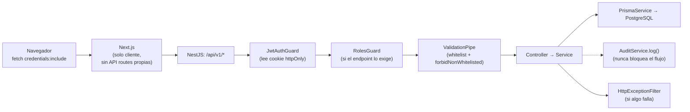

# Arquitectura real de Prodexa

## Resumen

Prodexa es un monolito modular: un backend NestJS (`apps/backend`) y un frontend
Next.js (`apps/frontend`), cada uno un único proceso desplegable, comunicándose por
HTTP/JSON sobre `/api/v1`. No hay microservicios, no hay cola de mensajes, no hay
comunicación entre servicios — la complejidad operativa se mantiene deliberadamente
baja porque no hay (todavía) una razón de negocio real para pagar el costo de
distribuir el sistema (ver [ADR-003](../adr/ADR-003-escalabilidad-futura.md), que sigue
vigente en su razonamiento aunque fue escrito antes de construir nada).

## Por qué módulos planos y no capas domain/application/infrastructure/presentation

El plan original de Fase 1 (`docs/architecture/clean_architecture_modular.md`,
conservado con su banner de "superado") proponía que cada módulo de backend tuviera
subcarpetas `domain/`, `application/`, `infrastructure/` y `presentation/`, con
Repository Pattern explícito y casos de uso como clases separadas de los servicios.

En la práctica, ningún módulo terminó así. Los módulos reales
(`apps/backend/src/{auth,organizations,formulations,production,suppliers,audit,
simulation,uploads,health}/`) siguen la convención idiomática de NestJS: un
`*.controller.ts`, un `*.service.ts` que habla directo con `PrismaService`, DTOs en su
propia carpeta `dto/`, y un `*.module.ts` que los conecta. Sin capa de dominio
separada, sin interfaces de repositorio.

La razón fue pragmática, no accidental: con un solo desarrollador y un dominio que
todavía estaba definiéndose sobre la marcha (la lista de "Fases" de este mismo repo
muestra decisiones que se revirtieron — RBAC se descartó y después se construyó, ver
[ADR-005](../adr/ADR-005-rbac-organizaciones-multiusuario.md)), una capa de abstracción
sobre Prisma no habría comprado nada real: no hay un segundo ORM que sustituir, no hay
un caso de uso que se invoque desde dos controladores distintos con reglas distintas.
Agregar la abstracción hoy sería complejidad especulativa — el mismo criterio aplicado
en otras decisiones del proyecto (ver "Decisiones de ingeniería" en el
[README](../../README.md)).

## Ciclo de vida de un request

Transversal a todos los requests: `pino-http` genera/reutiliza un `X-Request-Id`,
lo loguea en JSON estructurado, y lo devuelve tanto en la respuesta exitosa como en
cualquier error (ver [`docs/observability/overview.md`](../observability/overview.md)).

## Multi-tenancy

Cada organización (`Organization`) es la unidad de aislamiento. `organizationId`
aparece en `User`, `Formulation`, `ProductionOrder`, `Supplier` e `Invitation`; toda
query de lectura filtra por el `organizationId` del usuario autenticado, nunca solo por
`userId` — así los datos de una formulación son visibles para todo el equipo de la
empresa, no solo para quien la creó, que es precisamente el requisito que motivó
construir RBAC (ver ADR-005).

## Diagramas completos

Los tres niveles C4, el diagrama entidad-relación y el de despliegue viven en
[`docs/diagrams/`](../diagrams/) como fuente única — este documento y otros enlazan
ahí en vez de reincrustar los mismos diagramas en varios archivos.
