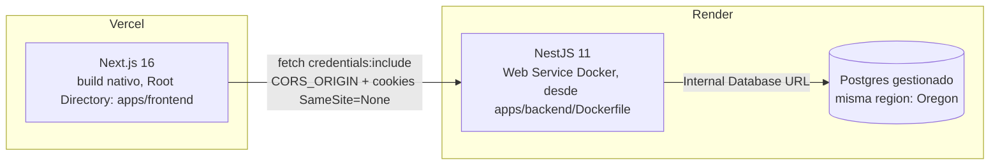

# Despliegue real

**Estado: Fase 8 construida y en producción.** Frontend en Vercel, backend en Render
(desde el `Dockerfile` existente), Postgres gestionado por Render.

## URLs en vivo

- **Frontend**: https://prodexa-iota.vercel.app
- **Backend**: https://prodexa-backend.onrender.com (`/api/v1` para la API, `/api/docs`
  para Swagger, `/health` y `/ready` para monitoreo)

## Arquitectura real desplegada



- **Frontend → Vercel**: Root Directory = `apps/frontend` (el monorepo no tiene Next.js
  en la raíz, hay que apuntarlo explícito). Build/output/install quedan en los defaults
  de Next.js una vez corregido el Root Directory.
- **Backend → Render**: Web Service tipo **Docker**, no Node nativo — reutiliza
  `apps/backend/Dockerfile` tal cual, mismo build que se prueba en local vía
  `docker-compose.yml`. Dockerfile Path: `apps/backend/Dockerfile`; Build Context:
  raíz del repo (el Dockerfile hace `COPY apps/backend/...` asumiendo eso).
- **Base de datos → Postgres gestionado de Render**, misma región (`Oregon`) que el
  Web Service para que se hablen por red privada.

## Variables de entorno de producción

Backend (Render):

| Variable | Valor en producción | Por qué difiere de local |
|---|---|---|
| `DATABASE_URL` | Internal Database URL del Postgres de Render | — |
| `CORS_ORIGIN` | `https://prodexa-iota.vercel.app` | el origin real de Vercel, no `localhost:3001` |
| `JWT_ACCESS_SECRET` / `JWT_REFRESH_SECRET` | generados con el botón "Generate" de Render | secretos reales, no los `changeme-*` de `.env.example` |
| `COOKIE_SECURE` | `true` | en local es `false` (no hay HTTPS) |
| `COOKIE_SAMESITE` | `none` | ver siguiente sección — es el cambio que hizo posible este despliegue |

Frontend (Vercel):

| Variable | Valor en producción |
|---|---|
| `NEXT_PUBLIC_API_URL` | `https://prodexa-backend.onrender.com/api/v1` |

`NEXT_PUBLIC_API_URL` se hornea dentro del build de Next.js — cambiarla después de un
deploy requiere un redeploy manual, no basta con guardar la variable.

## El bug que había que resolver antes de desplegar: cookies cross-site

`apps/backend/src/auth/cookie.util.ts` tenía `sameSite: 'lax'` fijo en el código.
Frontend (`*.vercel.app`) y backend (`*.onrender.com`) son dos **sitios** distintos (no
solo subdominios), y el frontend llama a la API con `credentials: 'include'`
(`apps/frontend/src/lib/api.ts`). Con `SameSite=Lax`, el navegador no envía la cookie en
esas llamadas — solo en navegación directa — así que el login habría "funcionado" pero
ninguna petición autenticada posterior habría reconocido la sesión.

Se resolvió haciendo `sameSite` configurable por entorno (`COOKIE_SAMESITE`, default
`lax` para no tocar el comportamiento local) en vez de cambiar el default global — en
producción se setea a `none`, que exige `COOKIE_SECURE=true` junto con él (el navegador
rechaza `SameSite=None` sin `Secure`).

## Migraciones en cada deploy

Ni el `Dockerfile` ni su `CMD` corren `prisma migrate deploy` — el contenedor solo
arranca el servidor. Render sí tiene un mecanismo dedicado para esto (**Advanced →
Pre-Deploy Command**), pero es una función de plan pago — en el plan **Free** ese campo
aparece bloqueado. La alternativa real usada acá: sobrescribir **Docker Command** en el
Web Service con

```
sh -c "npx prisma migrate deploy && node dist/src/main.js"
```

que encadena las migraciones antes de arrancar el servidor, sin depender de una
función que el plan gratuito no habilita.

## Limitaciones reales del plan gratuito (documentadas, no escondidas)

- **Cold start del backend**: el Web Service gratuito de Render se duerme tras
  inactividad: la primera petición después de dormir puede tardar 50+ segundos.
  Aceptable para un proyecto de portafolio, no para un SLA real.
- **Uploads no persisten entre deploys**: el filesystem del Web Service es efímero sin
  un Disk pago — cualquier imagen subida en el editor de preparación de formulaciones
  (`UPLOADS_DIR`) se pierde en el próximo deploy o reinicio.
- **Sin staging separado**: un solo entorno de producción, sin ambiente intermedio.
  Razonable para el tamaño actual del proyecto; sería el primer paso si esto creciera.

## Qué falta para que esto sea un pipeline de CD completo

- Activar "Require status checks to pass" en la protección de rama de GitHub — hoy
  `.github/workflows/test.yml` corre en cada push/PR pero nada bloquea un merge si
  falla (paso manual pendiente en la configuración del repo, no en el código).
- Rollback definido y probado, runbook de incidentes.
- Build de imágenes versionadas (hoy Render reconstruye desde el commit en cada push,
  no hay un registry de imágenes con tags propios).

## Qué ya existía y se reutilizó tal cual

- Dockerfiles multi-stage para ambas apps (ver [`docker.md`](docker.md)) — el de backend
  se usa sin ninguna modificación para el deploy real.
- CI con tests + typecheck + lint + cobertura + gitleaks + `npm audit` en cada push
  (ver [`docs/testing/ci.md`](../testing/ci.md)).
- `/health` y `/ready` ya respondían lo que Render necesita para Health Check Path y
  para confirmar que la base de datos responde (ver
  [`docs/observability/overview.md`](../observability/overview.md)).
