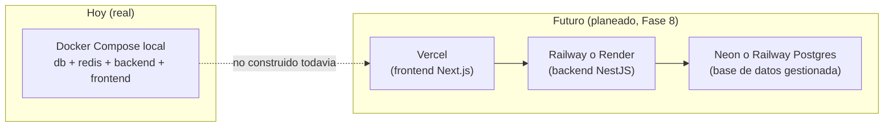

# Plan de despliegue (futuro, no construido)

**Estado real: Fase 8 (DevOps, CI/CD y despliegue) del checklist del proyecto está en
0% — nada de lo descrito abajo existe todavía.** Este documento existe para que la
intención quede clara y separada de lo que ya funciona, no para aparentar que ya se
desplegó algo.

## Destino previsto

- **Frontend → Vercel**: encaja naturalmente con Next.js (App Router), build/deploy
  automático por push.
- **Backend → Railway o Render**: contenedor de `apps/backend/Dockerfile`, sin
  necesidad de gestionar servidores.
- **Base de datos → Neon o el Postgres gestionado de Railway**: para no operar
  Postgres a mano en producción.

## Qué falta de verdad antes de que esto sea real

Del checklist local (Fase 8), todo sin empezar:
- Build de imágenes versionadas y publicación de artefactos.
- Deploy automático a staging + promoción a producción con aprobación.
- Configuración separada por entorno (local/staging/producción) y gestión segura de
  secrets por entorno.
- Rollback definido y probado, runbook de incidentes.
- Activar "Require status checks to pass" en la protección de rama de GitHub — hoy
  `.github/workflows/test.yml` corre en cada push/PR pero nada bloquea un merge si
  falla (paso manual pendiente en la configuración del repo, no en el código).

## Qué sí existe ya, reutilizable el día que esto se construya

- Dockerfiles multi-stage para ambas apps (ver [`docker.md`](docker.md)).
- CI con tests + typecheck + lint + cobertura + gitleaks + `npm audit` en cada push
  (ver [`docs/testing/ci.md`](../testing/ci.md)) — la base de un pipeline de CD ya
  está, falta el paso de "y ahora despliega".
- `/health` y `/ready` ya responden lo que un orquestador necesita para saber si el
  backend está listo (ver [`docs/observability/overview.md`](../observability/overview.md)).
