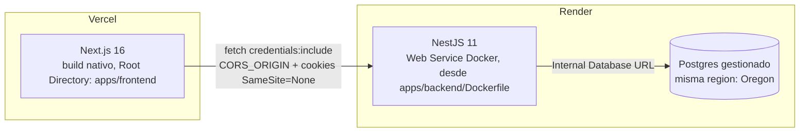

# Despliegue real

**Estado: Fase 8 construida y en producción.** Frontend en Vercel, backend en Render
(desde el `Dockerfile` existente), Postgres gestionado por Render.

## URLs en vivo

- **Frontend**: https://prodexa-iota.vercel.app
- **Backend**: https://prodexa-backend.onrender.com (`/api/v1` para la API, `/health` y
  `/ready` para monitoreo). `/api/docs` (Swagger) esta deshabilitado en produccion por
  defecto — ver `docs/security/owasp-top10.md` A05.

## Arquitectura real desplegada


```mermaid
flowchart LR
    subgraph Vercel
        FE["Next.js 16<br/>build nativo, Root Directory: apps/frontend"]
    end
    subgraph Render
        BE["NestJS 11<br/>Web Service Docker, desde apps/backend/Dockerfile"]
        DB[("Postgres gestionado<br/>misma region: Oregon")]
    end

    FE -- "fetch credentials:include<br/>CORS_ORIGIN + cookies SameSite=None" --> BE
    BE -- "Internal Database URL" --> DB
```

- **Frontend → Vercel**: Root Directory = `apps/frontend` (el monorepo no tiene Next.js
  en la raíz, hay que apuntarlo explícito). Build/output/install quedan en los defaults
  de Next.js una vez corregido el Root Directory.
- **Backend → Render**: Web Service tipo **Docker**, no Node nativo — reutiliza
  `apps/backend/Dockerfile` tal cual, mismo build que se prueba en local vía
  `docker-compose.yml`. Dockerfile Path: `apps/backend/Dockerfile`; Build Context:
  raíz del repo (el Dockerfile hace `COPY apps/backend/...` asumiendo eso).
- **Base de datos → Postgres gestionado de Render**, misma región (`Oregon`) que el
  Web Service para que se hablen por red privada.

## Variables de entorno de producción

Backend (Render):

| Variable | Valor en producción | Por qué difiere de local |
|---|---|---|
| `DATABASE_URL` | Internal Database URL del Postgres de Render | — |
| `CORS_ORIGIN` | `https://prodexa-iota.vercel.app` | el origin real de Vercel, no `localhost:3001` |
| `JWT_ACCESS_SECRET` / `JWT_REFRESH_SECRET` | generados con el botón "Generate" de Render | secretos reales, no los `changeme-*` de `.env.example` |
| `COOKIE_SECURE` | `true` | en local es `false` (no hay HTTPS) |
| `COOKIE_SAMESITE` | `none` | ver siguiente sección — es el cambio que hizo posible este despliegue |

Frontend (Vercel):

| Variable | Valor en producción |
|---|---|
| `NEXT_PUBLIC_API_URL` | `https://prodexa-backend.onrender.com/api/v1` |

`NEXT_PUBLIC_API_URL` se hornea dentro del build de Next.js — cambiarla después de un
deploy requiere un redeploy manual, no basta con guardar la variable.

## El bug que había que resolver antes de desplegar: cookies cross-site

`apps/backend/src/auth/cookie.util.ts` tenía `sameSite: 'lax'` fijo en el código.
Frontend (`*.vercel.app`) y backend (`*.onrender.com`) son dos **sitios** distintos (no
solo subdominios), y el frontend llama a la API con `credentials: 'include'`
(`apps/frontend/src/lib/api.ts`). Con `SameSite=Lax`, el navegador no envía la cookie en
esas llamadas — solo en navegación directa — así que el login habría "funcionado" pero
ninguna petición autenticada posterior habría reconocido la sesión.

Se resolvió haciendo `sameSite` configurable por entorno (`COOKIE_SAMESITE`, default
`lax` para no tocar el comportamiento local) en vez de cambiar el default global — en
producción se setea a `none`, que exige `COOKIE_SECURE=true` junto con él (el navegador
rechaza `SameSite=None` sin `Secure`).

## Migraciones en cada deploy (manual, por ahora)

Ni el `Dockerfile` ni su `CMD` corren `prisma migrate deploy` — el contenedor solo
arranca el servidor. Render sí tiene un mecanismo dedicado para esto (**Advanced →
Pre-Deploy Command**), pero es una función de plan pago — en el plan **Free** ese campo
aparece bloqueado.

Se probó la alternativa obvia — sobrescribir el **Docker Command** del Web Service
para encadenar migración + arranque:

```
sh -c "npx prisma migrate deploy && node dist/src/main.js"
```

pero esto causó un crash silencioso por falta de memoria (el plan Free tiene 512MB):
durante la ventana en que migración y arranque coexisten, el pico de uso supera ese
límite. Sin ese Docker Command override, el arranque solo (`node dist/src/main.js`)
funciona bien — confirmado aislando la variable.

**Estado actual:** la pestaña **Shell** de Render (que permitiría correr el comando
directo contra el Web Service) es una función de plan pago — no está disponible en el
plan **Free** usado acá. La alternativa real: Render expone, en el panel del servicio
de Postgres, tanto una "Internal Database URL" (solo alcanzable entre servicios de
Render) como una "External Database URL" (alcanzable desde cualquier máquina). Las
migraciones nuevas se aplican a mano desde la máquina local con esa URL externa:

```
DATABASE_URL="<external-url-de-render>" npx prisma migrate deploy
```

Es un paso manual, no automatizado — y ya causó un incidente real en producción por
olvidarlo (`/audit-log` devolviendo 500 porque dos migraciones nunca se habían
aplicado; ver [`docs/observability/known-gaps.md`](../observability/known-gaps.md)).
Aceptable para el volumen de cambios de este proyecto, pero es el punto más frágil
del proceso de deploy actual.

**Camino a automatizarlo sin plan pago:** el producto **Jobs** de Render (distinto de
un Web Service — corre el comando una vez y termina, no queda un proceso persistente
compitiendo por los mismos 512MB) es la vía estándar para esto. No se confirmó todavía
si el plan Free actual lo habilita — hay que probarlo directo en el dashboard de Render
antes de asumirlo.

**Checklist para el próximo deploy que agregue una migración** (mientras el paso
siga siendo manual — el objetivo es que sea imposible olvidarlo, no solo documentarlo):

1. ¿Este PR agrega o modifica algo en `apps/backend/prisma/migrations/`? Si no, seguí
   normal — este checklist no aplica.
2. Antes de dar el deploy por terminado, correr desde la máquina local:
   ```
   DATABASE_URL="<external-url-de-render>" npx prisma migrate status
   ```
   para confirmar qué migraciones están pendientes contra la base real (no asumir).
3. Si hay pendientes, aplicarlas: `DATABASE_URL="<external-url-de-render>" npx prisma
   migrate deploy`.
4. Verificar un endpoint real que toque la tabla/columna nueva (no solo `/health` —
   ese incidente pasó justo porque `/health` no toca Postgres y quedó verde mientras
   `/audit-log` ya estaba en 500).

## Limitaciones reales del plan gratuito (documentadas, no escondidas)

- **Cold start del backend**: el Web Service gratuito de Render se duerme tras
  inactividad: la primera petición después de dormir puede tardar 50+ segundos.
  Aceptable para un proyecto de portafolio, no para un SLA real.
- **Uploads no persisten entre deploys**: el filesystem del Web Service es efímero sin
  un Disk pago — cualquier imagen subida en el editor de preparación de formulaciones
  (`UPLOADS_DIR`) se pierde en el próximo deploy o reinicio.
- **Sin staging separado**: un solo entorno de producción, sin ambiente intermedio.
  Razonable para el tamaño actual del proyecto; sería el primer paso si esto creciera.

## Qué falta para que esto sea un pipeline de CD completo

- La protección de rama de GitHub ya está activa (PR obligatorio + los 4 jobs de
  `test.yml` como status checks requeridos; ver
  [`docs/testing/ci.md`](../testing/ci.md#branch-protection)), pero el deploy en sí
  sigue sin estar atado a ese resultado — Render redespliega desde el commit en push
  a `main` independientemente de si CI corrió o terminó en verde.
- Rollback definido y probado, runbook de incidentes.
- Build de imágenes versionadas (hoy Render reconstruye desde el commit en cada push,
  no hay un registry de imágenes con tags propios).

## Qué ya existía y se reutilizó tal cual

- Dockerfiles multi-stage para ambas apps (ver [`docker.md`](docker.md)) — el de backend
  se usa sin ninguna modificación para el deploy real.
- CI con tests + typecheck + lint + cobertura + gitleaks + `npm audit` en cada push
  (ver [`docs/testing/ci.md`](../testing/ci.md)).
- `/health` y `/ready` ya respondían lo que Render necesita para Health Check Path y
  para confirmar que la base de datos responde (ver
  [`docs/observability/overview.md`](../observability/overview.md)).
