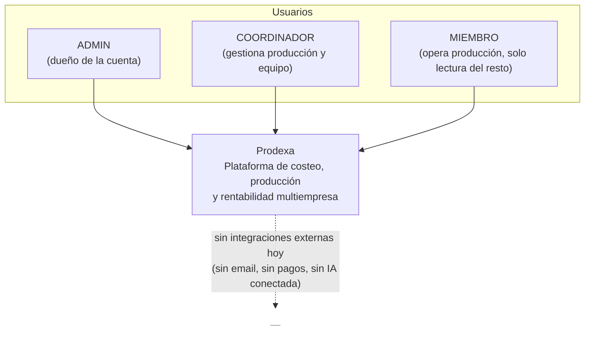

# C4 — Nivel 1: Contexto del sistema

Quién usa Prodexa y con qué sistemas externos interactúa. Hoy, honestamente, es un
diagrama simple: **no hay integraciones externas todavía** — no hay proveedor de
email, no hay pasarela de pago, no hay proveedor de IA conectado (Fase 9 del roadmap,
decidido pero no construido). No se inventan cajas que no existen.

Los tres roles pertenecen siempre a una `Organization` — no hay usuarios "sueltos" sin
empresa. El nivel de acceso de cada uno está detallado en
[`docs/api/endpoints.md`](../api/endpoints.md).
