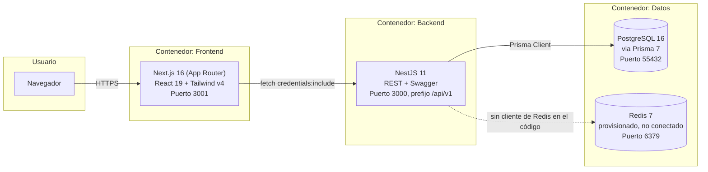

# C4 — Nivel 2: Contenedores

Los bloques desplegables que componen Prodexa y cómo se comunican. Versión completa
del diagrama simplificado del [README](../../README.md).

## Qué corre en cada contenedor

- **Frontend**: solo cliente — no tiene API routes propias ni lógica de servidor más
  allá de lo que Next.js necesita para renderizar. Todo el estado remoto viene del
  backend.
- **Backend**: único proceso NestJS. Todos los módulos (`auth`, `organizations`,
  `formulations`, `production`, `suppliers`, `audit`, `simulation`, `uploads`,
  `health`) corren en el mismo proceso — ver
  [Nivel 3](c4-nivel3-componentes.md) para su descomposición interna.
- **PostgreSQL**: única fuente de verdad persistente.
- **Redis**: contenedor levantado y con healthcheck en `docker-compose.yml`, pero sin
  ningún cliente de Redis en las dependencias del proyecto — ver
  [`docs/deployment/docker.md`](../deployment/docker.md).
