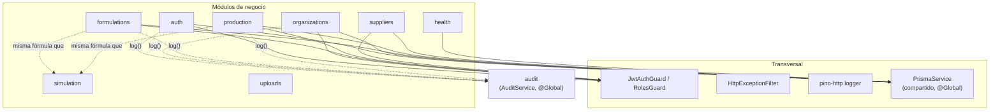

# C4 — Nivel 3: Componentes (backend)

Descomposición interna del contenedor NestJS. Cada caja es un módulo real de
`apps/backend/src/` (ver el detalle de responsabilidades en
[`docs/architecture/modulos_y_contextos.md`](../architecture/modulos_y_contextos.md)).

## Por qué `audit` y `PrismaService` son globales

`AuditModule` y `PrismaModule` están marcados `@Global()` — cualquier módulo puede
inyectar `AuditService`/`PrismaService` sin declararlos explícitamente en su lista de
imports. Es la única excepción deliberada a "módulos planos, sin capa compartida
implícita": auditoría y acceso a datos son verdaderamente transversales a todo el
sistema, no una dependencia de un módulo hacia otro.

## `simulation` no depende de nada

`SimulationService.calculate()` es una función pura — no inyecta `PrismaService`, no
tiene estado. `formulations` y `production` la llaman para calcular costo/precio/
utilidad, pero `simulation` no sabe que existen. La misma fórmula está espejada en
`apps/frontend/src/lib/costing.ts` para las vistas de solo lectura del cliente.
