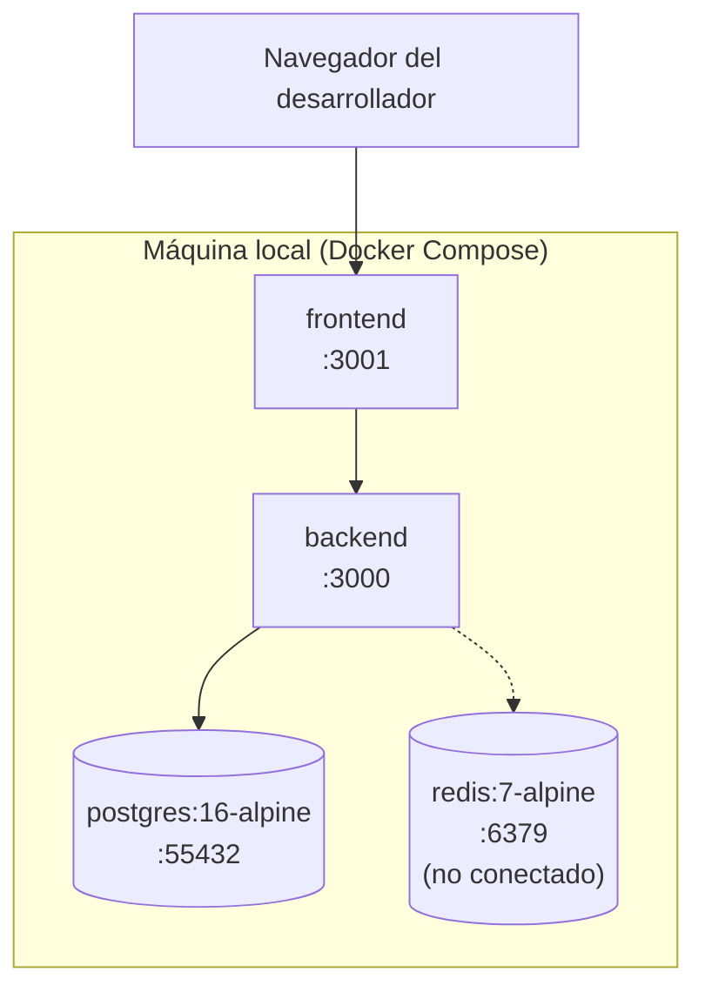
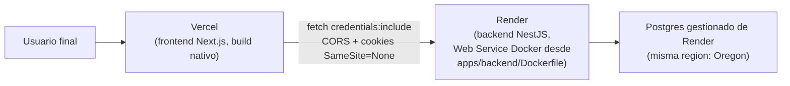

# Diagrama de despliegue

Dos escenarios reales: desarrollo local y producción.

## Local, vía Docker Compose

Un solo comando (`npm run compose:up`) levanta los 4 contenedores. Detalle completo:
[`docs/deployment/docker.md`](../deployment/docker.md).

## Producción: Vercel + Render

Sin ambiente de staging separado — un solo entorno de producción, razonable para el
tamaño actual del proyecto. Variables de entorno, el fix de cookies cross-site
necesario para que esto funcione, migraciones en cada deploy y las limitaciones reales
del plan gratuito en
[`docs/deployment/roadmap-despliegue.md`](../deployment/roadmap-despliegue.md).
