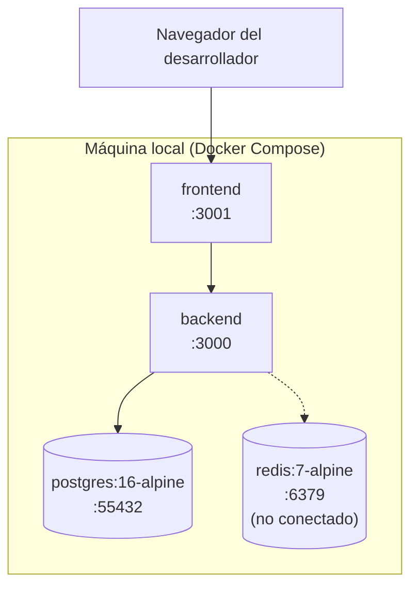
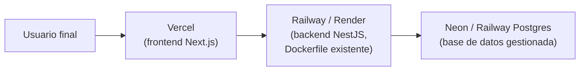

# Diagrama de despliegue

Dos escenarios, claramente separados: lo que corre hoy y lo que está planeado.

## Hoy: local, vía Docker Compose

Un solo comando (`npm run compose:up`) levanta los 4 contenedores. Detalle completo:
[`docs/deployment/docker.md`](../deployment/docker.md).

## Planeado (Fase 8, no construido)

**Nada de este segundo diagrama existe todavía** — no hay ambiente de staging ni de
producción desplegado. Ver el detalle de qué falta en
[`docs/deployment/roadmap-despliegue.md`](../deployment/roadmap-despliegue.md).
