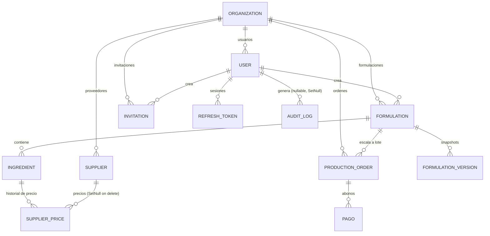

# Diagrama entidad-relación

Esquema completo: `apps/backend/prisma/schema.prisma`. Decisiones de diseño detrás de
este modelo: [`docs/database/overview.md`](../database/overview.md).

## Notas que el diagrama no puede mostrar por sí solo

- **`organizationId`** aparece en `User`, `Formulation`, `ProductionOrder`, `Supplier`
  e `Invitation` — es la columna que de verdad implementa el aislamiento
  multi-tenant; toda query de negocio filtra por ella.
- **`Supplier → SupplierPrice` es `SetNull`, no `Cascade`.** Eliminar un proveedor
  conserva el historial de precios — mismo patrón "archivar/desvincular, no borrar"
  que `Formulation.activa`.
- **`AuditLog.userId` es nullable + `SetNull`.** Un evento `LOGIN_FAILED` contra un
  correo que no existe no tiene usuario al cual atribuirse.
- **`FormulationVersion.snapshot` es un `Json`**, no columnas normalizadas — full
  snapshot del estado anterior a cada edición, no algo que se consulte con filtros SQL.
- **`rol`, `estadoPago`, `estadoProduccion`, `registroSanitarioEstado` son `String`**,
  con su conjunto de valores válidos enforced en el código de aplicación (DTOs, la
  máquina de estados), no como `enum` nativo de Postgres. Ver
  [`estado-produccion-uml.md`](estado-produccion-uml.md) para el caso más elaborado.
