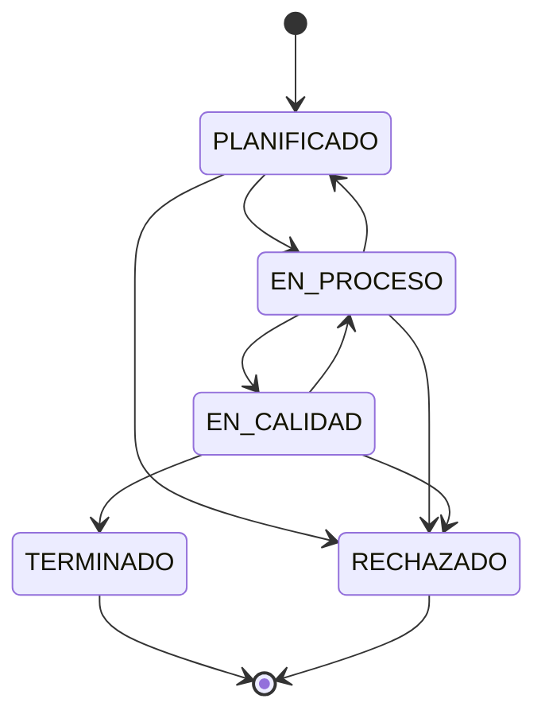

# UML — Máquina de estados de producción

El único diagrama UML de este proyecto — se agrega porque `estadoProduccion` es una
regla de negocio real, actualmente enforced en ambos lados (backend y frontend), y
genuinamente no trivial de seguir solo leyendo el mapa de transiciones en el código.
Otros candidatos a UML (diagrama de clases, secuencia completa por endpoint) no
aportarían nada que las tablas de [`docs/api/endpoints.md`](../api/endpoints.md) no
digan ya con más claridad.

## Reglas que el diagrama encapsula

- **El control de calidad es obligatorio.** La única forma de llegar a `TERMINADO` es
  pasando por `EN_CALIDAD` — no existe un atajo desde `PLANIFICADO` o `EN_PROCESO`.
- **Se permite retroceder exactamente un paso**, para reprocesar un lote que no pasó
  calidad sin perder su registro (ej. `EN_CALIDAD → EN_PROCESO`).
- **`RECHAZADO` es alcanzable desde cualquier estado no final** — un lote se puede
  rechazar en cualquier punto del proceso.
- **`TERMINADO` y `RECHAZADO` son terminales.** Ninguna transición sale de ellos.
- Un lote `RECHAZADO` se conserva para trazabilidad, pero se excluye de utilidad e
  ingreso en Reportes/Dashboard/Análisis — no se vendió, no debería inflar la
  rentabilidad real.

## Dónde vive la regla (una sola fuente de verdad, espejada)

- Backend (autoridad real, valida en cada `PATCH /production-orders/:id`):
  `TRANSICIONES_ESTADO_PRODUCCION` en
  `apps/backend/src/production/dto/create-production-order.dto.ts`.
- Frontend (espejo, para que la UI nunca ofrezca una transición que el backend vaya a
  rechazar): mismo nombre en `apps/frontend/src/lib/costing.ts`.
