# Guía de usuario de Prodexa

Esta guía es para quien **usa** Prodexa en el día a día — quien fabrica y vende, no
quien programa. Si buscas documentación técnica (arquitectura, API, base de datos),
esa vive en [`docs/`](../) y se enlaza desde el [`README.md`](../../README.md) del
proyecto. Aquí no hay jerga de desarrollo: solo pantallas reales de la aplicación y
qué hacer con ellas.

## Índice

1. [Crear tu cuenta y la de tu empresa](#1-crear-tu-cuenta-y-la-de-tu-empresa)
2. [Iniciar sesión](#2-iniciar-sesión)
3. [El Dashboard: tu vistazo rápido](#3-el-dashboard-tu-vistazo-rápido)
4. [Crear tu primera formulación](#4-crear-tu-primera-formulación)
5. [Costos: simular el precio de venta](#5-costos-simular-el-precio-de-venta)
6. [Preparar: registrar un lote de producción](#6-preparar-registrar-un-lote-de-producción)
7. [Calidad: el control obligatorio antes de vender](#7-calidad-el-control-obligatorio-antes-de-vender)
8. [Análisis: cuánto deja cada producto](#8-análisis-cuánto-deja-cada-producto)
9. [Reportes: tu dinero real y la cartera por cobrar](#9-reportes-tu-dinero-real-y-la-cartera-por-cobrar)
10. [Proveedores: comparar precios](#10-proveedores-comparar-precios)
11. [Configuración: tu equipo, tus tarifas, tus sesiones](#11-configuración-tu-equipo-tus-tarifas-tus-sesiones)
12. [Auditoría: quién hizo qué y cuándo](#12-auditoría-quién-hizo-qué-y-cuándo)
13. [Preguntas frecuentes](#13-preguntas-frecuentes)
14. [¿Encontraste un problema o tienes una idea?](#14-encontraste-un-problema-o-tienes-una-idea)

---

## 1. Crear tu cuenta y la de tu empresa

Entra a Prodexa y haz clic en **Regístrate**. Tienes dos caminos:

- **Crear empresa**: si eres el primero de tu negocio en usar Prodexa. Quedas como
  **administrador** y luego puedes invitar al resto de tu equipo (ver sección 11).
- **Unirme con código**: si alguien de tu empresa ya te invitó y te compartió un código
  de invitación.

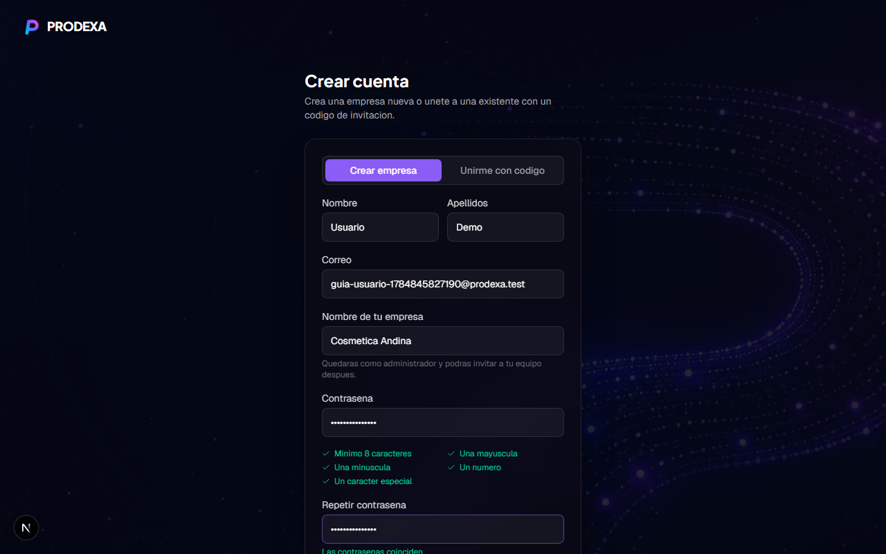

La contraseña necesita mínimo 8 caracteres, una mayúscula, una minúscula, un número y
un carácter especial — el formulario te va marcando en verde cada requisito a medida
que lo cumples, así no tienes que adivinar por qué no te deja continuar.

## 2. Iniciar sesión

Con tu correo y contraseña entras directo al Dashboard de tu empresa.

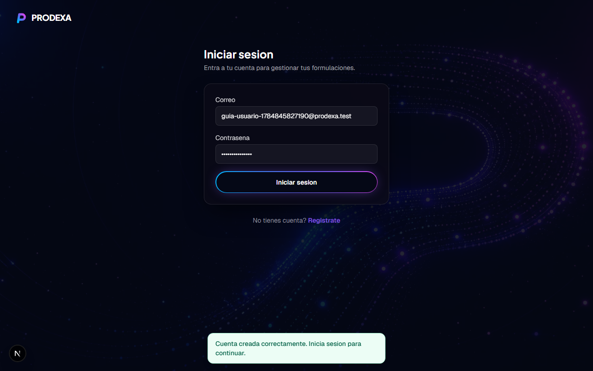

Tu sesión queda activa por 30 días en ese dispositivo/navegador. Puedes ver y cerrar
cualquier sesión abierta (por ejemplo si iniciaste sesión en un computador que ya no
usas) desde **Configuración → Sesiones activas** — ver sección 11.

## 3. El Dashboard: tu vistazo rápido

Es lo primero que ves al entrar. Responde, sin que tengas que buscar nada, la pregunta
"¿cómo va mi negocio hoy?":


- **Formulaciones, margen promedio y utilidad total**: un resumen de todo tu catálogo.
- **Capacidad utilizada y proyecciones**: cuánto de tu capacidad mensual estás usando y
  una proyección de la próxima semana/mes — necesita al menos 2 semanas (o 2 meses)
  completos de lotes registrados para calcularse, así que al principio va a pedirte que
  sigas registrando lotes.
- **Margen por formulación** y **costo promedio por categoría**: para detectar de un
  vistazo qué producto o categoría se está saliendo de rango.
- Un aviso cuando tienes **lotes esperando revisión de calidad** (ver sección 7) y, si
  eres administrador, un aviso de seguridad si hubo intentos de inicio de sesión
  fallidos recientes en tu cuenta.
- Puedes filtrar todo el panel por periodo de tiempo y por formulación o categoría
  específica con los selectores de arriba a la derecha.

## 4. Crear tu primera formulación

Ve a **Formulaciones** en el menú lateral. Ahí registras el producto con su lista de
ingredientes:

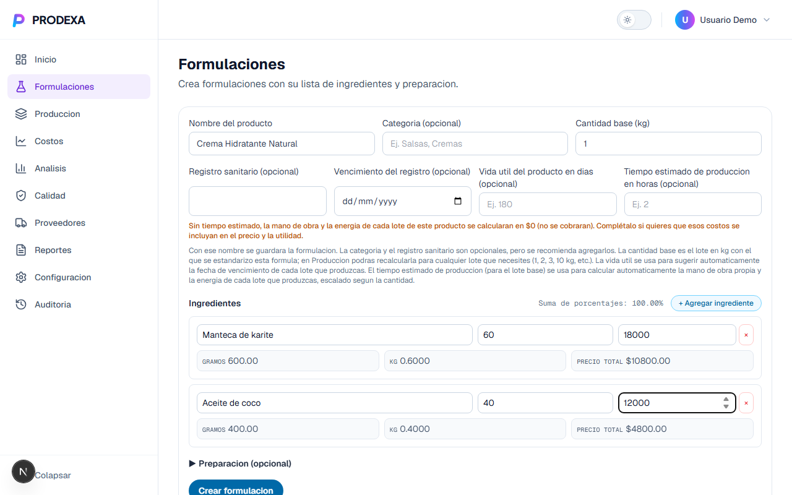

Campos importantes:

- **Cantidad base (kg)**: el tamaño del lote con el que estandarizas la fórmula (por
  ejemplo, 1 kg). Después, en Preparar, puedes escalarla a cualquier cantidad que
  necesites producir realmente (3 kg, 10 kg, etc.) — Prodexa recalcula todo solo.
- **Ingredientes**: nombre, porcentaje en la fórmula y precio por kg de cada uno. La
  suma de porcentajes debe llegar a 100%; los gramos y el costo de cada ingrediente se
  calculan automáticamente según la cantidad base.
- **Registro sanitario y su vencimiento** (opcional pero recomendado): si lo llenas,
  Prodexa te avisa automáticamente cuando esté por vencer (ver sección 7, Calidad).
  Igual puedes usar Prodexa sin él si tu producto todavía no lo tiene.
- **Tiempo estimado de producción**: si no lo llenas, la mano de obra y la energía de
  cada lote de este producto se calculan en $0 (no se cobran). Complétalo si quieres
  que esos costos reales se incluyan en el precio y en la utilidad.
- **Preparación** (opcional): un editor de texto enriquecido para dejar la receta o el
  procedimiento paso a paso, con imágenes si quieres.

Una vez creada, así se ve:

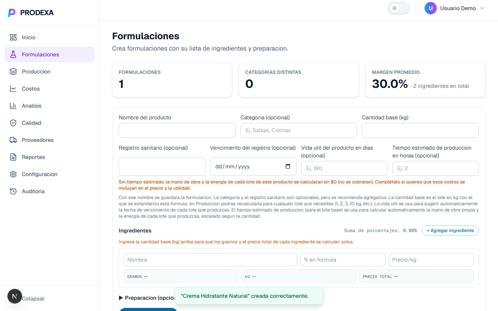

**Nota:** una formulación con lotes de producción ya registrados no se puede eliminar —
perderías ese historial financiero real. En su lugar, se archiva: deja de aparecer
para producir nuevos lotes, pero conserva todos sus datos.

## 5. Costos: simular el precio de venta

Antes de producir de verdad, usa **Costos** para simular: cuánto te cuesta un lote de
cierto tamaño, qué precio de venta te conviene, y qué pasa si aplicas un descuento
mayorista o una promoción.

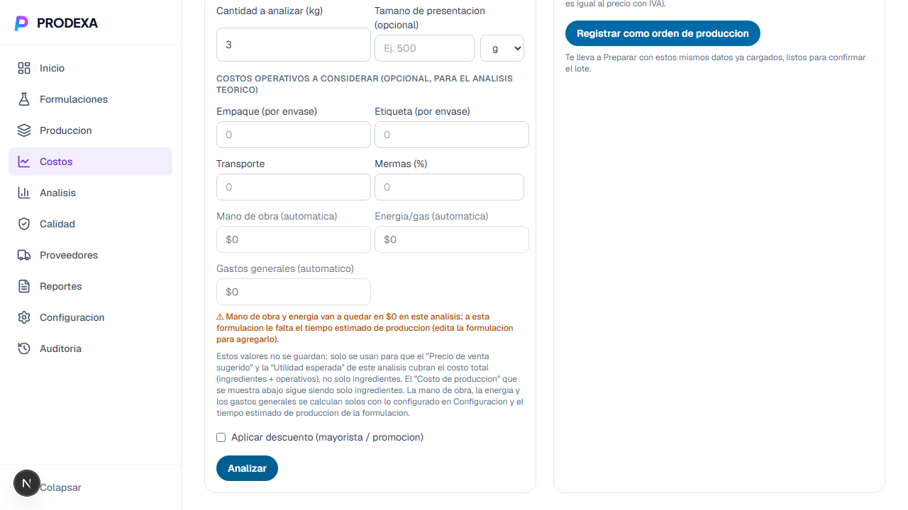

Ingresa la cantidad que quieres analizar y, si aplica, costos operativos adicionales
(empaque, etiqueta, transporte, mermas). El IVA (19%, tasa legal fija) y tu margen por
defecto se aplican automáticamente sobre el costo total.

Cuando el análisis te convence, el botón **"Registrar como orden de producción"** te
lleva directo a Preparar con esos mismos datos ya cargados — no hace falta retipear
nada.

## 6. Preparar: registrar un lote de producción

Aquí confirmas que de verdad vas a producir (o ya produjiste) un lote. Si vienes desde
Costos, los datos llegan precargados con un aviso:

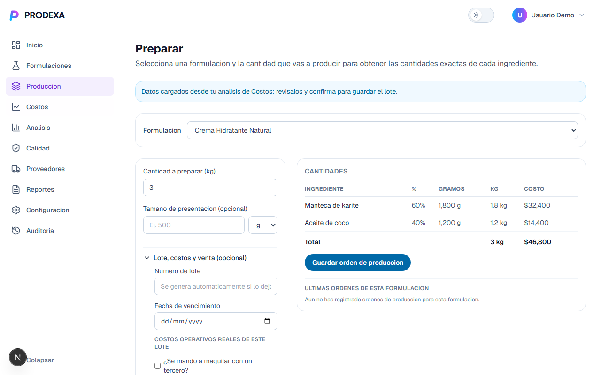

Selecciona la formulación y la cantidad a preparar, y Prodexa calcula los gramos y el
costo exacto de cada ingrediente para ese tamaño de lote. Al guardar, el lote queda
registrado con un número (se genera solo si lo dejas en blanco) y entra a un flujo de
estados que no puedes saltarte:

```
PLANIFICADO → EN_PROCESO → EN_CALIDAD → TERMINADO
                                      ↘ RECHAZADO (en cualquier punto)
```

Es decir: **ningún lote puede marcarse como Terminado sin pasar antes por control de
calidad.** Puedes avanzar el estado del lote directamente desde la tabla de "Últimas
órdenes de esta formulación", con el botón **Editar**.

## 7. Calidad: el control obligatorio antes de vender

Esta pantalla tiene dos partes:

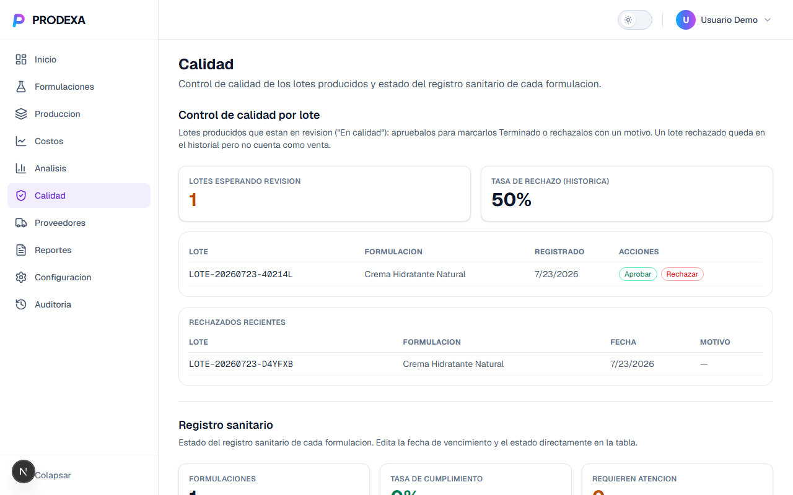

- **Control de calidad por lote**: los lotes que están "En calidad" esperando tu
  revisión. Apruébalos (pasan a Terminado) o recházalos con un motivo — un lote
  rechazado queda en el historial para que no pierdas el registro, pero no cuenta como
  venta ni entra a tu cartera por cobrar.
- **Registro sanitario**: el estado de vigencia del registro sanitario de cada
  formulación (vigente, por vencer, vencido, suspendido, en trámite). Si le pusiste
  fecha de vencimiento al crear la formulación, aquí te avisa con anticipación (4 meses
  antes) cuando esté por vencer, para que alcances a renovarlo a tiempo.

## 8. Análisis: cuánto deja cada producto

Elige una formulación del selector y obtén su ficha completa de rendimiento:


- **Costo de producción, precio de venta sugerido, utilidad estimada y punto de
  equilibrio** (a partir de qué porcentaje del lote empiezas a ganar).
- **Desglose de costo por ingrediente**: para saber cuál insumo pesa más en tu costo.
- **Tasa de rechazo en calidad**: qué porcentaje de tus lotes terminados realmente se
  rechazan — una señal de calidad real, no solo de costos.
- **Dónde queda frente a las demás**: un ranking de utilidad contra el resto de tu
  catálogo, para saber qué producto de verdad te conviene empujar.

Puedes exportar la ficha completa a PDF con el botón de arriba a la derecha.

## 9. Reportes: tu dinero real y la cartera por cobrar

A diferencia de Análisis (que proyecta), Reportes muestra **lo que ya produjiste de
verdad**, con filtro por fecha o por número de lote:

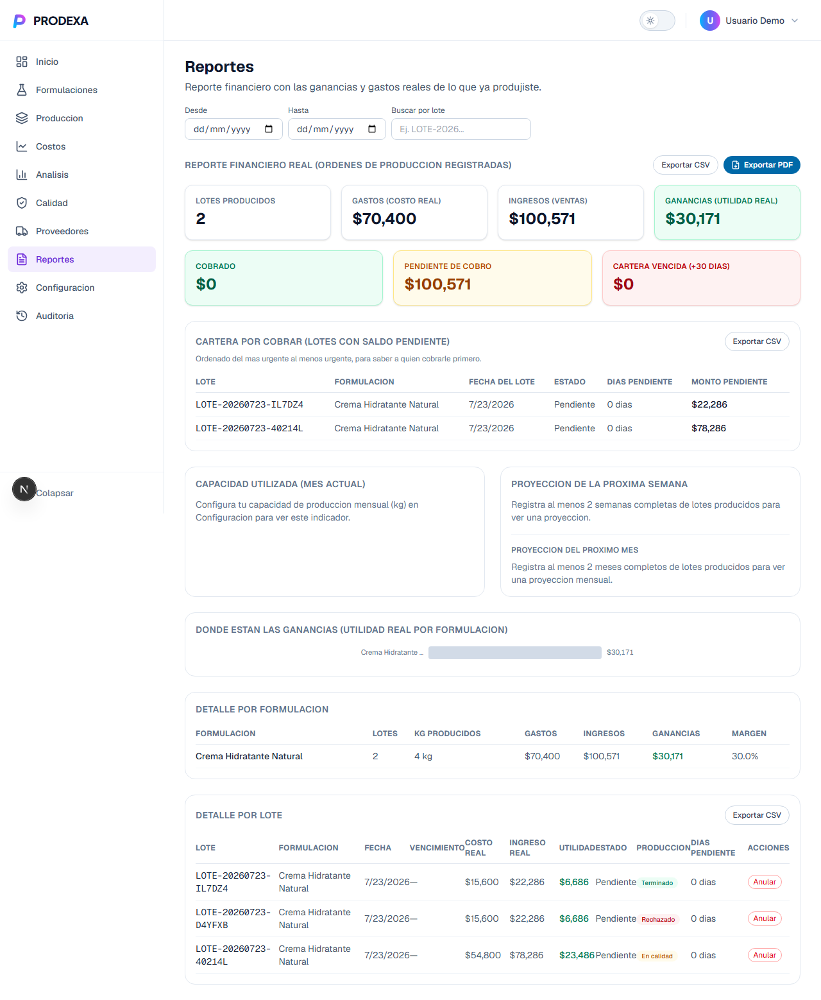

La sección **Cartera por cobrar** es la más práctica del día a día: muestra solo los
lotes con saldo pendiente de pago, ordenados del más urgente al menos urgente. Tiene su
propio botón de exportar a CSV, separado del reporte general, para que puedas llevarte
justo esa lista a quien haga la cobranza.

## 10. Proveedores: comparar precios

Los proveedores se crean automáticamente la primera vez que registras el precio de un
ingrediente en Formulaciones, pero aquí puedes gestionarlos directamente:

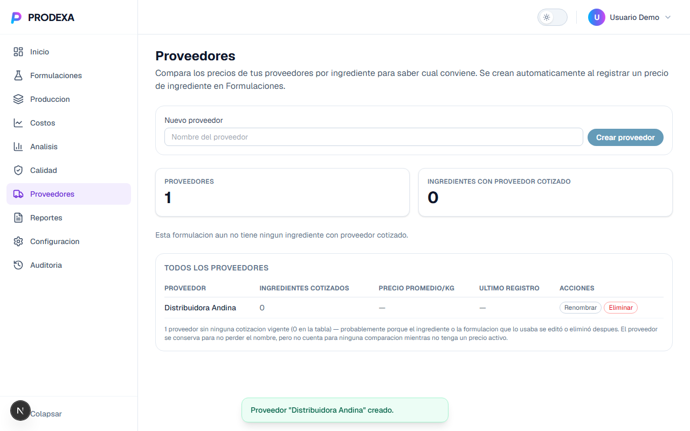

Crea, renombra o elimina un proveedor — útil para limpiar duplicados (ej. "Dist.
Andina" vs "Distribuidora Andina") sin perder el historial de precios que ya tienen
asociado. La tabla te muestra cuántos ingredientes tiene cotizados cada uno y su precio
promedio por kg, para decidir con cuál te conviene más comprar.

## 11. Configuración: tu equipo, tus tarifas, tus sesiones

Todo lo que necesitas administrar de tu cuenta y tu empresa vive aquí:

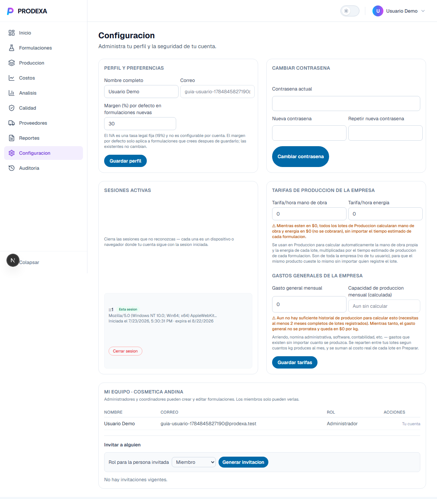

- **Perfil y preferencias**: tu nombre y el margen por defecto que se aplica a las
  formulaciones nuevas que crees de aquí en adelante (las que ya existen no cambian).
- **Cambiar contraseña**.
- **Sesiones activas**: cada dispositivo o navegador donde tu cuenta sigue con la
  sesión iniciada. Si no reconoces alguna, ciérrala desde aquí.
- **Tarifas de producción de la empresa** (mano de obra y energía por hora) y **gasto
  general mensual**: son de toda la empresa, no de tu usuario — así el mismo producto
  cuesta lo mismo sin importar quién registre el lote. Prodexa los usa para calcular
  automáticamente la mano de obra y la energía real de cada lote, según el tiempo
  estimado de producción de cada formulación.
- **Mi equipo**: solo visible para administradores. Aquí ves quién pertenece a tu
  empresa, su rol, e invitas a alguien nuevo generando un código de invitación.

### Los tres roles

| Rol | Qué puede hacer |
|---|---|
| **Administrador** | Todo: crear/editar formulaciones, gestionar producción, invitar y remover miembros, cambiar roles, ver Auditoría. |
| **Coordinador** | Crear y editar formulaciones y producción, igual que un administrador en el día a día operativo — pero no gestiona el equipo ni ve Auditoría. |
| **Miembro** | Solo puede ver las formulaciones y la información de producción, sin editarlas. |

## 12. Auditoría: quién hizo qué y cuándo

Solo visible para administradores. Es la bitácora de seguridad y de negocio de tu
empresa: inicios de sesión, cambios de precios, ediciones de formulaciones, cambios de
rol, tarifas modificadas — cada evento con quién lo hizo, cuándo, y su detalle
específico.

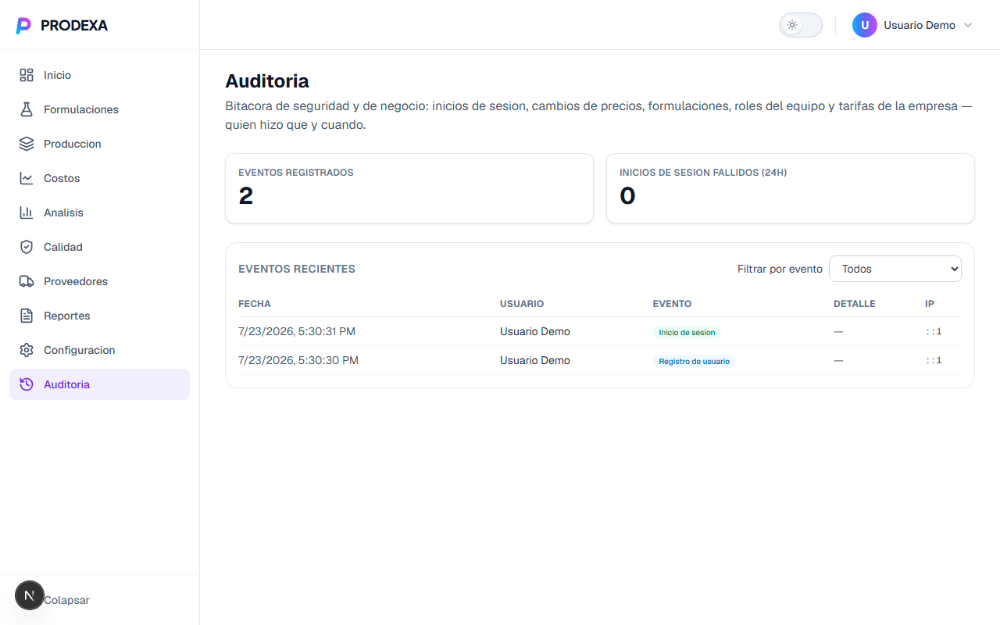

Puedes filtrar por tipo de evento. Es la herramienta para responder "¿quién cambió
esto?" sin tener que preguntarle a todo el equipo.

## 13. Preguntas frecuentes

**¿Necesito saber de tecnología para usar Prodexa?** No. Esta guía cubre todo lo que
necesitas desde el navegador; no hay nada que instalar ni configurar por tu cuenta.

**¿Qué pasa si me equivoco al crear una formulación?** Puedes editarla en cualquier
momento desde Formulaciones. Cada edición queda guardada como una versión en su
historial, así que nunca pierdes el dato anterior.

**¿Por qué no puedo eliminar una formulación o un proveedor?** Si ya tiene historial
real asociado (lotes producidos, o precios cotizados), Prodexa lo protege para que no
pierdas ese historial financiero — te ofrece archivarlo en su lugar.

**¿Por qué mi lote no aparece como vendido en Reportes?** Revisa su estado en
Producción/Preparar: solo los lotes marcados **Terminado** cuentan en tus reportes de
rentabilidad y cartera por cobrar. Uno **Rechazado** queda en el historial pero no
cuenta como venta.

**¿Puedo usar Prodexa si todavía no tengo registro sanitario?** Sí, ese campo es
opcional al crear una formulación. Cuando lo tengas, edítala y agrégalo — Calidad
empezará a avisarte de su vigencia automáticamente.

**¿Qué diferencia hay entre Costos y Análisis?** Costos **simula** (¿qué pasaría si
produjera X cantidad, con este descuento?) antes de producir. Análisis **reporta**
sobre lo que ya construiste como formulación (indicadores acumulados, ranking,
exportable a PDF). Reportes, un paso más allá, muestra solo lo que **ya produjiste de
verdad** con lotes reales.

**¿Mis datos se comparten con otras empresas que usan Prodexa?** No. Cada empresa
(organización) ve únicamente sus propias formulaciones, lotes, proveedores y reportes.

## 14. ¿Encontraste un problema o tienes una idea?

Esta guía cubre el uso normal de la aplicación. Si encontraste un error o quieres
proponer una mejora, o eres parte del equipo técnico, la documentación de
[contribución](../../CONTRIBUTING.md) explica cómo reportarlo. Si se trata de una
vulnerabilidad de seguridad, sigue el proceso responsable descrito en
[`SECURITY.md`](../../SECURITY.md) en vez de reportarla públicamente.
